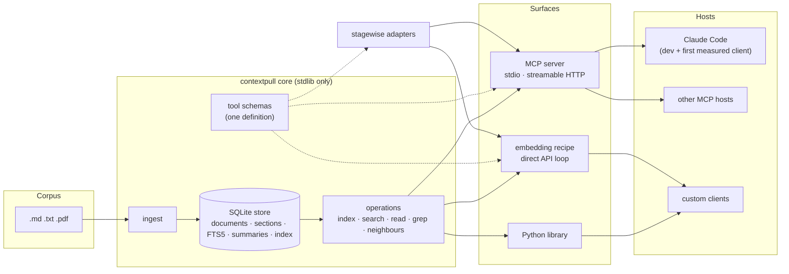
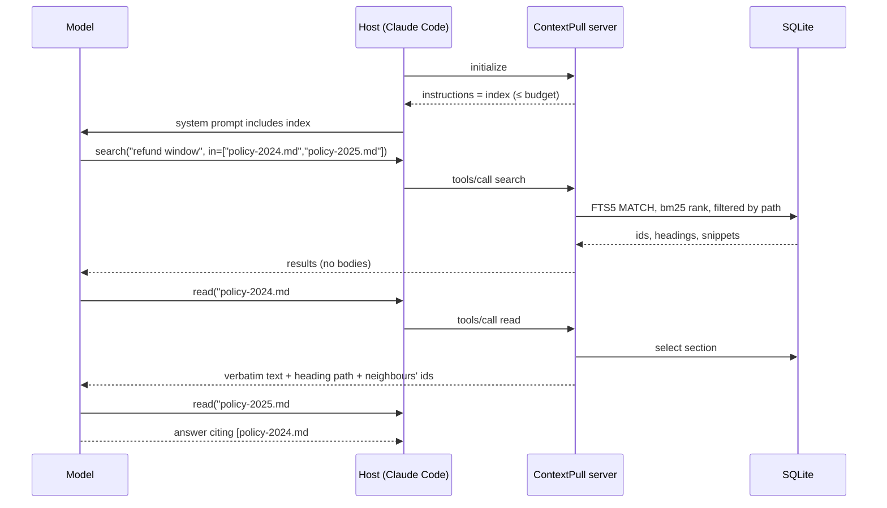

# Architecture

## The shape in one picture



Three layers, one direction of dependency: surfaces depend on the core, the core depends on nothing but the Python standard library.

## Layers

### Core library

Package `contextpull`. Zero runtime dependencies.

| Module | Responsibility |
|---|---|
| `store` | Open, create, migrate the SQLite file. All reads and writes go through here. |
| `ingest` | Discover files, parse, section, hash, write. Incremental by document hash. |
| `parse` | Markdown, plain text, and (optional extra) PDF into a common block stream: headings, paragraphs, tables, code. |
| `section` | Turn blocks into size-bounded sections with heading paths and stable ordinals. Never splits inside a table or a code block. |
| `index` | Build the token-budgeted table of contents from document summaries; hierarchical when the flat form does not fit. |
| `ops` | The five operations as plain functions over a `Store`. |
| `tools` | JSON schemas and descriptions for the five tools. Imported by every surface. |
| `summarize` | Optional one-line document summaries through a provider-agnostic LLM wrapper, cached by document hash. Offline fallback: first heading plus first sentence. |
| `cli` | `ingest`, `serve`, `index`, `search`, `read`, `grep`, `export-chunks`. |

### MCP surface

Package extra `contextpull[mcp]`, module `contextpull.mcp`. Wraps `ops` with the official MCP Python SDK. Registers the five tools from `tools`, serves the index through server instructions and as a resource, and speaks stdio by default with streamable HTTP as an option. It holds no logic of its own beyond argument validation and formatting.

### Embedding recipe

Documentation and one runnable example, `examples/direct_api_loop.py`, showing how a custom client puts the index in a system prompt and exposes the five tools to a model through the Anthropic or OpenAI API. It uses the same `tools` schemas, so a tool the MCP server knows is a tool the recipe knows.

### Other languages

The store file is the contract (ADR 009). TypeScript and Go get store-native readers and servers; every other language can use the Python server as a sidecar over MCP or HTTP on day one. See [Multi-language SDK plan](sdk-plan.md).

### Evaluation adapters

Package `contextpull.eval`. Two stagewise adapters, one driving a direct API loop and one driving Claude Code headless. Described in [Evaluation](evaluation.md).

## Data flow

### Ingest time

```mermaid
sequenceDiagram
  participant CLI as contextpull ingest
  participant P as parse
  participant S as section
  participant DB as SQLite
  participant L as LLM (optional)
  CLI->>DB: open or create store, read document hashes
  loop each file under corpus root
    CLI->>CLI: sha256(file); skip if unchanged
    CLI->>P: parse(file) → blocks
    P->>S: section(blocks, max_chars)
    S->>DB: replace document + sections in one transaction
  end
  DB->>DB: rebuild FTS5 rows for changed documents
  opt summaries enabled
    CLI->>L: one call per changed document, cached by hash
    L-->>DB: summary
  end
  CLI->>DB: build index text, record token count and corpus fingerprint
```

### Query time, through an MCP host



The store is opened read-only at query time. Nothing at query time calls an LLM; the host's model is the only model in the loop.

## Boundaries and what crosses them

| Boundary | Crosses | Never crosses |
|---|---|---|
| Corpus → store | Parsed text, structure, hashes | File handles, absolute paths |
| Store → model | Index text, IDs, headings, snippets, verbatim sections on request | Whole documents, top-k bodies unasked |
| Core → surfaces | Functions and tool schemas | SQL, file layout |
| Server → host | MCP messages | Anything requiring network from the core |

## Deployment shapes

1. **Local, per project.** `.contextpull/store.sqlite` next to the docs, server started by the host over stdio. The default and the development setup.
2. **Shared, read-only.** One store built in CI, served over streamable HTTP to several hosts. Same binary, one flag.
3. **Embedded.** A custom client imports the library and calls `ops` directly. No server process.

## Where stagewise sits

stagewise is a separate package and stays framework-agnostic. ContextPull provides `export-chunks` so stagewise can build an eval set over exactly the sections the tools return, and provides adapters that satisfy stagewise's one-method `Retriever` protocol. The dependency goes one way, from `contextpull.eval` to `stagewise`, and only in the eval extra.
