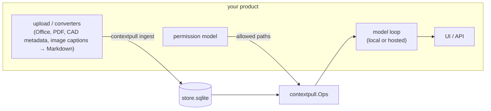

# Embedding ContextPull in your product

ContextPull is MIT licensed and designed to be embedded: the core has no dependencies, the store is one file, and the five operations are plain functions. This page is for teams building their own client rather than attaching an MCP host.

## The shape



You own ingestion triggers, converters for formats ContextPull does not read, the permission model, the model loop and the interface. ContextPull owns sectioning, indexing, identifier-safe search, section addressing and citations.

## Ingest

Build the store wherever it is convenient, in CI or on the target machine, and ship the file. Supported inputs: Markdown, plain text, docx, xlsx, pptx (standard library only), PDF with the `pdf` extra. Anything else, convert to Markdown first and drop it in the corpus folder. Keep converter output deterministic so re-ingest stays incremental.

```sh
pip install contextpull            # add [pdf] for PDFs
contextpull ingest /data/corpus --store /data/store.sqlite
contextpull ingest /data/corpus --store /data/store.sqlite --summarizer openai:gpt-5.4-mini   # any OpenAI-compatible endpoint via OPENAI_BASE_URL, including local servers
```

Air-gapped deployments: nothing in the core calls a network. Summaries and embeddings are optional and point at whatever OpenAI-compatible endpoint you run locally.

## Query

```python
from contextpull import Store, Ops

with Store.open("/data/store.sqlite") as store:   # read-only
    ops = Ops(store)
    index_text = ops.index()                       # put this in your system prompt
    hits = ops.search("refund window", in_=["policies/*"], limit=10)
    section = ops.read(hits.hits[0].id, context=1)
```

For a model loop, `contextpull.tools.TOOLS` are the tool definitions in Anthropic shape and `openai_tools()` converts them; `contextpull.tools.call(ops, name, args)` dispatches. `examples/direct_api_loop.py` is a complete loop in under a hundred lines.

## Access control

The store has no notion of users, on purpose. Two patterns:

1. **One store per permission group.** Simplest. Ingest each group's documents into its own file and open the right one per request. No code.
2. **A filter in your client.** Decide which document paths a user may see and pass them as `in=` to `search` and `grep`; check `read` and `neighbours` ids against the same rule; filter the index text to permitted documents so the model cannot learn what else exists. `examples/embed_with_acl.py` is a working wrapper that does all of this in fifty lines.

Refuse unauthorised `read` with the same error the store gives for a missing id, so a denied section is indistinguishable from an absent one.

## Concurrency and updates

Open the store read-only in your request handlers; SQLite in WAL mode serves concurrent readers. Re-ingest writes in one transaction per document; readers keep the previous snapshot until it commits and pick up the new index on their next `index()` call. One connection per thread.

## Measure before you ship

The pull pattern depends on the model reading sections rather than answering from snippets. Our benchmark measured a small model with reasoning off at recall 0.62 over sections read against 0.96 for a hybrid push pipeline, with most of the gap being snippets answered from rather than read; Claude Code read the right section on every sampled question. Before committing a product to it, run [ragbisect](https://github.com/mi2arun/ragbisect) against your corpus and your model through `examples/ragbisect_agentic.py`; it takes an afternoon and tells you the recall, the cost per question and whether the model actually reads.

## Versioning

Pin `contextpull` to a minor version. The store format carries its own version (`schema_version` in `meta`); a reader refuses a store whose major it does not support. Rebuilding the store from the corpus is always safe.
